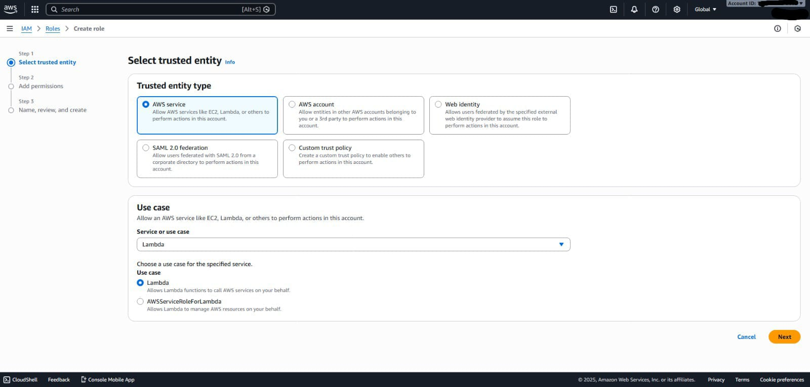
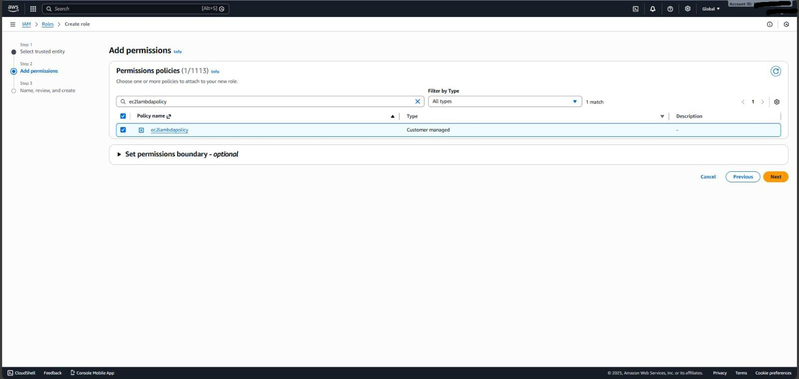
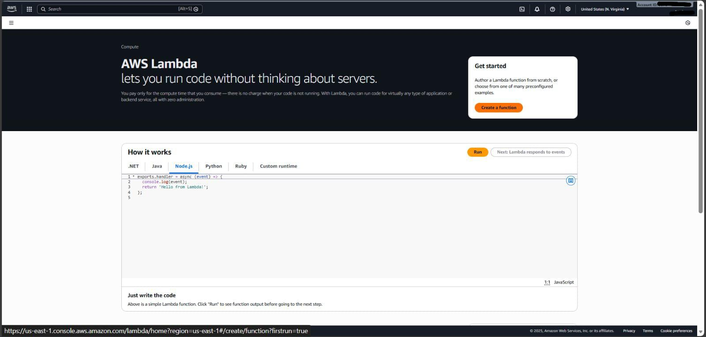
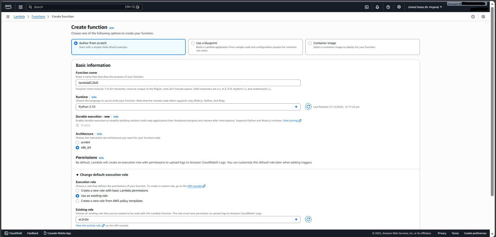
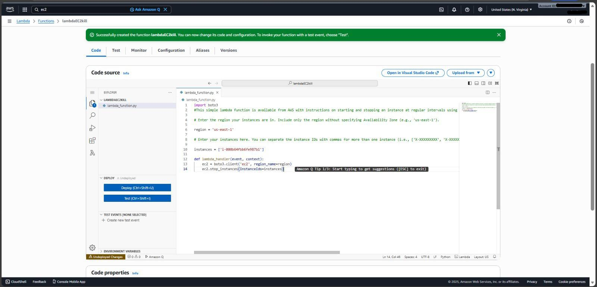
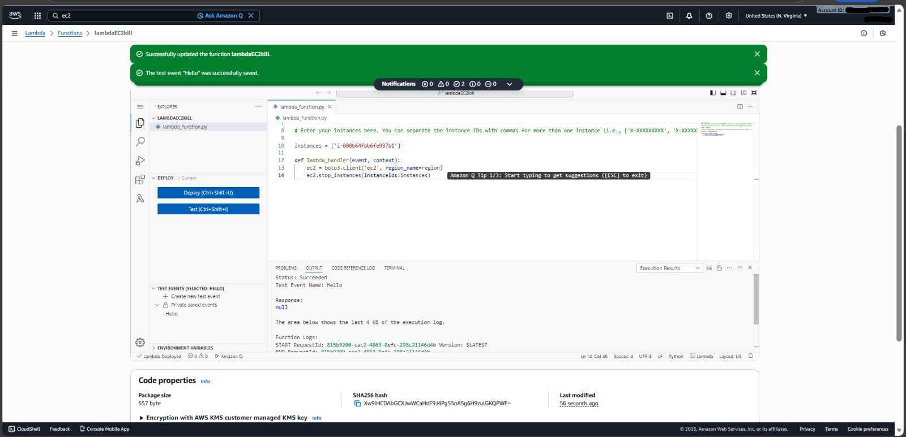
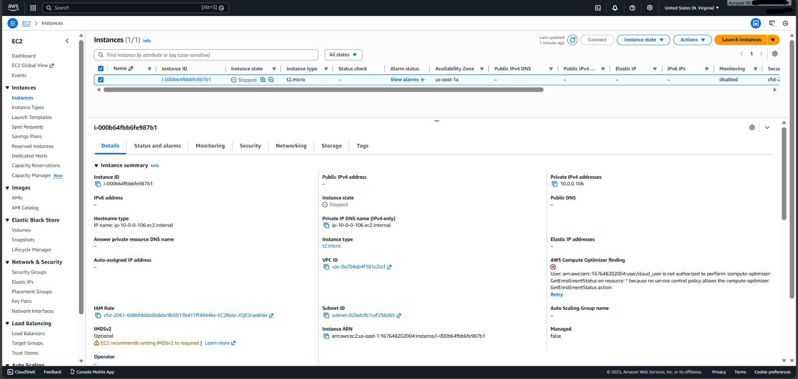

# Creating a Basic Lambda Function to Shut Down an EC2 Instance

This project demonstrates how to stop a running Amazon EC2 instance using an AWS Lambda function.
It helps understand basic automation using AWS services for cost and resource management.

---

## Objective
- To automate the shutdown of an EC2 instance using AWS Lambda.
- To understand the use of IAM roles and permissions for secure service access.

---

## Prerequisites
- An active AWS account
- Basic knowledge of AWS Console
- A running EC2 instance

---

## Step 1: Login to AWS Management Console

- Open a web browser and go to the AWS Management Console.
- Login using valid AWS account credentials.


---

## Step 2: Select Trusted Entity for IAM Role

- Navigate to **IAM → Roles → Create role** and select **AWS service** as the trusted entity.
- Choose **Lambda** as the use case so the Lambda function can assume this role.




## Step 3: Create Custom IAM Policy

- Navigate to **IAM → Policies → Create policy** and switch to the **JSON** tab.
- Paste a custom policy that allows CloudWatch logging and EC2 stop actions.


## Step 4: Review and Create IAM Policy

- Review the policy permissions and provide a policy name (for example, **ec2lambdapolicy**).
- Confirm the permissions and click **Create policy** to save it.


## Step 5: Attach IAM Policy to Role

- Navigate to **IAM → Roles**, create a role for **Lambda**, and proceed to the **Add permissions** step.
- Search for the custom policy (**ec2lambdapolicy**) and attach it to the role.



## Step 6: Review and Create IAM Role

- Provide a role name (for example, **ec2role**) and review the trusted entity and attached permissions.
- Confirm the configuration and click **Create role** to complete the IAM role setup.


## Step 7: Open AWS Lambda Console

- Navigate to the **AWS Lambda** service from the AWS Management Console.
- Click on **Create a function** to begin creating a new Lambda function.



## Step 8: Create Lambda Function

- In the **AWS Lambda** console, select **Author from scratch** and enter a function name (for example, `lambdaEC2kill`).
- Choose **Python** as the runtime and select **Use an existing role**, then choose the IAM role (`ec2role`).




## Step 9: Identify Running EC2 Instance

- Navigate to **EC2 → Instances** in the AWS Management Console.
- Ensure the target EC2 instance is in the **Running** state and copy the **Instance ID**.


## Step 10: Update Lambda Function Code

- Open the created Lambda function and go to the **Code** tab.
- Paste the Python code to stop the EC2 instance and replace the **Instance ID** with the target EC2 instance ID.



## Step 11: Test the Lambda Function

- Click **Deploy** to save the Lambda function changes.
- Click **Test** and verify that the execution status is **Succeeded**.



## Step 12: Verify EC2 Instance Stopped

- Navigate to **EC2 → Instances** in the AWS Management Console.
- Confirm that the EC2 instance state has changed to **Stopped** after running the Lambda function.



## IAM Policy Used for Lambda

A custom IAM policy was created to allow the Lambda function to:

- Write logs to Amazon CloudWatch  
- Stop EC2 instances  

### IAM Policy JSON

```json
{
  "Version": "2012-10-17",
  "Statement": [
    {
      "Effect": "Allow",
      "Action": [
        "logs:CreateLogGroup",
        "logs:CreateLogStream",
        "logs:PutLogEvents"
      ],
      "Resource": "arn:aws:logs:*:*:*"
    },
    {
      "Effect": "Allow",
      "Action": [
        "ec2:Stop*"
      ],
      "Resource": "*"
    }
  ]
}
```

## Conclusion

In this lab, we successfully created an AWS Lambda function with a custom IAM role and policy to stop an EC2 instance.  
By testing the Lambda function, we verified that the EC2 instance automatically transitioned from **Running** to **Stopped**, demonstrating serverless automation using AWS services.


